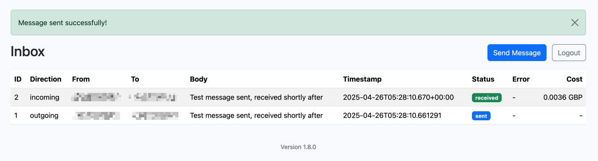

# Telnyx SMS Web App

A lightweight, containerized, secure web app to **send and receive SMS messages** through the [Telnyx Messaging API](https://developers.telnyx.com/docs/messaging).



- Built with [FastAPI](https://fastapi.tiangolo.com/)  
- Fully Dockerized  
- Secure Login
- Receive incoming SMS via Telnyx webhook
- Resend failed SMS
- Store incoming and outgoing messages in SQLite
- Resend failed outgoing messages
- Auto-refresh inbox view
- Signature verification for secure webhooks
- Flash alerts for success/error

## Requirements

- Docker with Docker Compose
- Telnyx Messaging Profile with:
  - API Key
  - Messaging Profile ID
  - Webhook URL configured
  - Webhook Public Key

## Environment Variables (`.env`)

Copy the example file:

```bash
cp .env.example .env
```

Edit .env and configure:

| Variable | Description |
| -------- | ----------- |
|`TELNYX_API_KEY`|Your Telnyx API Key|
|`TELNYX_MESSAGING_PROFILE_ID`|Your Messaging Profile ID|
|`TELNYX_FROM_NUMBER`|Your Telnyx phone number (E.164 format)|
|`TELNYX_PUBLIC_KEY`|Telnyx Webhook Public Key|
|`APP_USERNAME`|Web UI username|
|`APP_PASSWORD`|Web UI password|
|`SESSION_SECRET`|Random long string for cookie security|
|`REFRESH_INTERVAL_SECONDS`|How often inbox auto-refreshes|

## Build and Run

1. Clone and Build:

```bash
docker-compose build
docker-compose up
```

1. Access the app:

- Navigate to: http://localhost:8400/
- Login using your username and password from `.env`

## Telnyx Webhook Configuration

In the Telnyx Portal:

1. Go to **Messaging > Profiles**.
1. Select your Messaging Profile.
1. Set the **Inbound Message Webhook URL** to:

    ```
    https://your-public-server.com/webhook
    ```

    _(Note: If running locally, use ngrok or similar tool to expose your port.)_

1. Copy your **Webhook Public Key** and set it in your `.env`.

All incoming webhooks are **signature verified** for security.

## API Endpoints

| Method | URL | Description |
| ------ | --- | ----------- |
| `POST` | `/send-sms` | Send a new SMS |
| `POST` | `/webhook` | Receive incoming SMS from Telnyx |
| `GET` | `/message`s | Fetch all messages as JSON (for auto-refresh) |
| `GET` | `/resend/{id}` | Resend a previously failed outgoing SMS |
| `GET` | `/` | Web inbox view |
| `GET` | `/send` | Form to compose/send SMS |

_All endpoints are protected by Auth except `/webhook`._

## License

MIT License.
